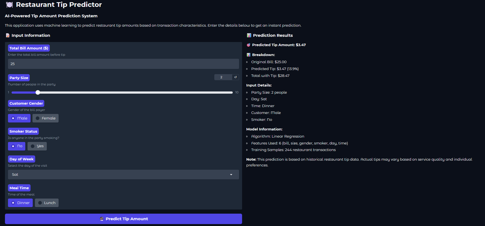
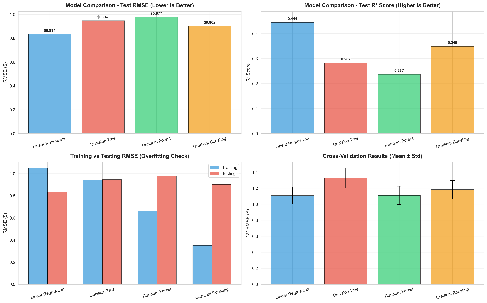

# 🍽️ Restaurant Tips Prediction - Machine Learning Project

[](https://www.python.org/downloads/)
[](https://opensource.org/licenses/MIT)
[](https://scikit-learn.org/)
[](https://gradio.app/)

> An end-to-end machine learning project that predicts restaurant tip amounts using regression algorithms. Surprisingly, Linear Regression outperformed complex ensemble methods, demonstrating that simple models generalize better with limited data.

## 📊 Project Overview

This project analyzes 244 restaurant transactions to predict tip amounts based on transaction features. We systematically compared four regression algorithms and discovered that **Linear Regression achieved the best performance** (RMSE: $0.83, R²: 0.44), outperforming Random Forest and Gradient Boosting which suffered from severe overfitting.

### Key Findings

- 🏆 **Best Model:** Linear Regression (simplest model won!)
- 📈 **Accuracy:** ±$0.83 typical error, 44% variance explained
- 🎯 **Main Predictor:** Total bill amount (85% importance)
- ⚠️ **Lesson:** Complex models overfit with small datasets (48-156% degradation)

## 🎥 Demo

### Web Interface (Gradio)

*Live tip prediction with interactive web interface*

### Model Performance Comparison

*Linear Regression wins*

## 📁 Project Structure

```
tips-prediction/
│
├── data/
│   └── tips.csv                      # Dataset (244 transactions)
│
├── src/
│   ├── tips_prediction.py            # Main analysis script
│   ├── tips_gradio_app.py            # Web interface
│   └── verify_setup.py               # Setup verification
│
├── models/                           # Saved models (generated)
│   ├── linear_regression_model.pkl   # Best model ⭐
│   ├── decision_tree_model.pkl
│   ├── random_forest_model.pkl
│   ├── gradient_boosting_model.pkl
│   ├── scaler.pkl
│   └── label_encoders.pkl
│
├── visualizations/                   # Generated charts
│   ├── eda_visualizations.png
│   ├── model_comparison.png
│   └── prediction_comparison.png
│
├── docs/
│   └── project_report.pdf            # Comprehensive report
│
├── requirements.txt                  # Dependencies
├── README.md                         # This file
└── LICENSE                           # MIT License
```

## 🚀 Quick Start

### Prerequisites

- Python 3.8 or higher
- pip package manager

### Installation

1. **Clone the repository**
```bash
git clone https://github.com/yasdev08/tips-prediction.git
cd tips-prediction
```

2. **Install dependencies**
```bash
pip install -r requirements.txt
```

3. **Verify setup**
```bash
python src/verify_setup.py
```

### Running the Project

**Option 1: Train models and generate analysis**
```bash
python src/tips_prediction.py
```
This will:
- Perform exploratory data analysis
- Train 4 regression models
- Generate 3 visualization charts
- Save all models as `.pkl` files
- Print comprehensive results

**Option 2: Launch interactive web interface**
```bash
python src/tips_gradio_app.py
```
Then open your browser to `http://localhost:7860`

## 📊 Dataset

**Source:** Restaurant tips dataset  
**Size:** 244 transactions  
**Features:**

| Feature | Type | Description |
|---------|------|-------------|
| `total_bill` | float | Total bill amount ($) |
| `tip` | float | Tip amount ($) - **TARGET** |
| `sex` | string | Gender (Male/Female) |
| `smoker` | string | Smoking section (Yes/No) |
| `day` | string | Day of week (Thur/Fri/Sat/Sun) |
| `time` | string | Meal time (Lunch/Dinner) |
| `size` | int | Party size (1-6 people) |

**Statistics:**
- Average bill: $19.79
- Average tip: $2.99 (16.08%)
- Tip range: $1.00 - $10.00

## 🤖 Models Implemented

### 1. Linear Regression (Winner 🏆)
- **RMSE:** $0.8336
- **R² Score:** 0.4441
- **Why it won:** No overfitting, best generalization
- **Use case:** Production model

### 2. Decision Tree Regressor
- **RMSE:** $0.9471
- **R² Score:** 0.2824
- **Issue:** Moderate overfitting
- **Feature importance:** total_bill (85%)

### 3. Random Forest Regressor
- **RMSE:** $0.9768
- **R² Score:** 0.2367
- **Issue:** Severe overfitting (48% degradation)
- **Lesson:** Too complex for 244 samples

### 4. Gradient Boosting Regressor
- **RMSE:** $0.9024
- **R² Score:** 0.3485
- **Issue:** Catastrophic overfitting (156% degradation)
- **Lesson:** Aggressive fitting on small data fails

## 📈 Results Summary

### Performance Comparison

| Model | Test RMSE | Test R² | Overfitting | Rank |
|-------|-----------|---------|-------------|------|
| **Linear Regression** | **$0.83** ✅ | **0.444** ✅ | None ✅ | **1st** |
| Gradient Boosting | $0.90 | 0.349 | 156% ❌ | 2nd |
| Decision Tree | $0.95 | 0.282 | 0.4% | 3rd |
| Random Forest | $0.98 | 0.237 | 48% ❌ | 4th |

### Feature Importance

From best model (Linear Regression):

| Feature | Coefficient | Impact |
|---------|-------------|--------|
| **size** | +0.240 | +$0.24 per person |
| **total_bill** | +0.094 | +9.4% of bill |
| **smoker** | -0.192 | Smokers tip less |
| **time** | +0.061 | Dinner > lunch |
| **sex** | +0.033 | Minimal |
| **day** | -0.007 | Negligible |

### Key Insights

1. **Total bill dominates predictions** (85% importance)
2. **Party size is secondary** (4% importance)
3. **Demographics barely matter** (<11% combined)
4. **Unexplained variance:** 56% (missing service quality data)

## 💻 Usage Examples

### Predicting Tips (Python API)

```python
from tips_prediction import predict_tip

# Example 1: Saturday dinner
tip = predict_tip(
    total_bill=25.50,
    size=2,
    sex='Male',
    smoker='No',
    day='Sat',
    time='Dinner'
)
print(f"Predicted tip: ${tip:.2f}")  # Output: ~$3.12
```

### Using the Gradio Interface

1. Start the app: `python src/tips_gradio_app.py`
2. Enter transaction details in the web form
3. Click "Predict Tip Amount"
4. View predicted tip, percentage, and total

### Making Predictions Programmatically

```python
import pickle
import numpy as np

# Load model
with open('models/linear_regression_model.pkl', 'rb') as f:
    model = pickle.load(f)

# Encode features (Female=0, Male=1, etc.)
features = np.array([[25.50, 2, 1, 0, 1, 0]])  # bill, size, sex, smoker, day, time

# Predict
tip = model.predict(features)[0]
print(f"Tip: ${tip:.2f}")
```

## 🔬 Methodology

### 1. Exploratory Data Analysis
- Statistical summary of all features
- Correlation analysis (total_bill correlation: 0.676)
- Distribution visualizations
- Categorical feature analysis

### 2. Data Preprocessing
- Label encoding for categorical variables
- Train-test split (80-20)
- Feature scaling (StandardScaler)
- No missing values to handle

### 3. Model Training
- 4 algorithms implemented
- 5-fold cross-validation
- Hyperparameter tuning for tree-based models
- Evaluation metrics: RMSE, R², MAE

### 4. Model Selection
- Test performance as primary criterion
- Overfitting analysis (train vs test gap)
- Cross-validation stability
- Interpretability consideration

## 📊 Visualizations

The project generates three comprehensive visualizations:

### 1. Exploratory Data Analysis
- Total bill distribution (right-skewed)
- Tip distribution (approximately normal)
- Party size distribution (concentrated at 2)
- Bill vs tip scatter plot (linear trend)
- Tips by day/time/gender/smoker
- Correlation heatmap

### 2. Model Comparison
- Test RMSE bar chart
- Test R² comparison
- Train vs test RMSE (overfitting check)
- Cross-validation results with error bars

### 3. Prediction Quality
- Actual vs predicted scatter plots (all 4 models)
- Perfect prediction line
- Trend lines showing model fit
- Correlation coefficients

## 🎯 Project Highlights

### What Makes This Project Special

1. **Counterintuitive Results**
   - Simple model beats complex ones
   - Demonstrates understanding over memorization
   - Real-world ML lesson about dataset size

2. **Rigorous Methodology**
   - Proper train-test split
   - Cross-validation for stability
   - Multiple evaluation metrics
   - Honest overfitting analysis

3. **Complete Implementation**
   - End-to-end pipeline
   - Production-ready code
   - Interactive deployment
   - Comprehensive documentation

4. **Educational Value**
   - Clear explanations
   - Well-commented code
   - Reproducible results
   - Best practices demonstrated

## 🚧 Limitations

### Data Constraints
- Small dataset (244 samples limits model complexity)
- Single restaurant (limited generalization)
- Missing critical features (service quality, wait time)
- No temporal patterns captured

### Model Constraints
- Moderate accuracy (56% variance unexplained)
- Linear assumptions may miss interactions
- No uncertainty quantification (confidence intervals)
- Sensitive to outliers

### Deployment Constraints
- Local deployment only (not cloud-hosted)
- No production monitoring or logging
- Static model (no online learning)
- Manual retraining required

## 🔮 Future Improvements

### Immediate Priorities

**1. Expand Dataset** (Highest Priority)
- Collect 1000+ transactions
- Include multiple restaurants
- Balance categorical features

**2. Add Service Quality Features** (Highest Impact)
- Server rating (1-5 scale)
- Wait time (minutes)
- Food quality rating
- Expected R² improvement: 0.44 → 0.70+

### Advanced Enhancements

**3. Feature Engineering**
- Interaction terms (bill × size)
- Polynomial features
- Time-based features (hour, season)

**4. Model Improvements**
- Confidence intervals (quantile regression)
- Robust regression (Huber loss)
- Ensemble stacking (if dataset grows)

**5. Deployment Upgrades**
- Cloud hosting (Hugging Face Spaces, AWS)
- Mobile app (iOS/Android)
- A/B testing framework
- Performance monitoring

## 📚 Technologies Used

### Core Libraries
- **Python 3.8+** - Programming language
- **pandas** - Data manipulation
- **NumPy** - Numerical computing
- **scikit-learn** - Machine learning algorithms
- **matplotlib** - Visualization
- **seaborn** - Statistical graphics
- **Gradio** - Web interface

### Algorithms
- Linear Regression (OLS)
- Decision Tree Regressor
- Random Forest Regressor
- Gradient Boosting Regressor

### Tools
- Jupyter/IPython - Interactive development
- Git - Version control
- pickle - Model serialization

## 🤝 Contributing

Contributions are welcome! Here's how you can help:

### Ways to Contribute

1. **Data Collection**
   - Add more restaurant transactions
   - Include service quality ratings
   - Expand to different restaurant types

2. **Feature Engineering**
   - Create new derived features
   - Implement interaction terms
   - Add temporal features

3. **Model Improvements**
   - Try new algorithms (XGBoost, LightGBM)
   - Implement hyperparameter optimization
   - Add confidence intervals

4. **Deployment**
   - Cloud deployment setup
   - Mobile app development
   - API development

5. **Documentation**
   - Improve README
   - Add code examples
   - Create tutorials

### Contribution Process

1. Fork the repository
2. Create a feature branch (`git checkout -b feature/AmazingFeature`)
3. Commit your changes (`git commit -m 'Add AmazingFeature'`)
4. Push to the branch (`git push origin feature/AmazingFeature`)
5. Open a Pull Request

## 📖 Documentation

- **Project Report:** [`docs/project_report.pdf`](docs/project_report.pdf) - Comprehensive 25+ page analysis
- **Code Documentation:** Inline comments and docstrings throughout
- **Setup Guide:** [`src/verify_setup.py`](src/verify_setup.py) - Automated setup verification

## 📝 License

This project is licensed under the MIT License - see the [LICENSE](LICENSE) file for details.

## 👥 Authors

- **[Yasser Mecherrem]** - *Initial work*- *Model development* - *Deployment* - [yasdev08](https://github.com/yasdev08)
- **[Ibtissem Debbi]** - *Data analysis* 
- **[Baki Fatima]** - *Documentation*


## 🙏 Acknowledgments

- Dataset source: Restaurant tips data
- Course: Machine Learning Fundamentals
- Institution: Univeristy of Mascara
- Inspiration: Real-world regression analysis
- Libraries: scikit-learn, Gradio, pandas communities

## 📞 Contact

- **Project Link:** [https://github.com/yasdev08/tips-prediction](https://github.com/yasdev08/tips-prediction)
- **Issues:** [https://github.com/yasdev08/tips-prediction/issues](https://github.com/yasdev08/tips-prediction/issues)
- **Email:** yasser.mechrem29@example.com

## 📊 Project Stats


---

## 🎓 Educational Use

This project is ideal for:
- **Machine Learning Students:** Complete end-to-end ML pipeline
- **Data Science Learners:** Practical regression analysis
- **Python Developers:** scikit-learn and Gradio integration
- **Educators:** Teaching overfitting and model selection

### Learning Outcomes

After studying this project, you will understand:
- ✅ Complete ML workflow (EDA → deployment)
- ✅ Regression algorithm comparison
- ✅ Overfitting detection and prevention
- ✅ When simple models outperform complex ones
- ✅ Feature importance analysis
- ✅ Model deployment with Gradio
- ✅ Professional code documentation

---

## ⭐ Star This Repository

If you found this project helpful, please consider giving it a ⭐️!

**Made with ❤️ for Machine Learning Education**

---

*Last Updated: January 2026*
